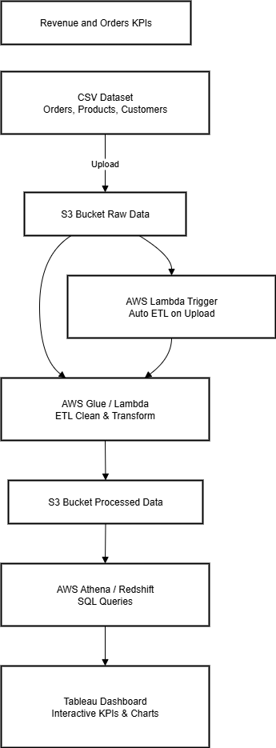
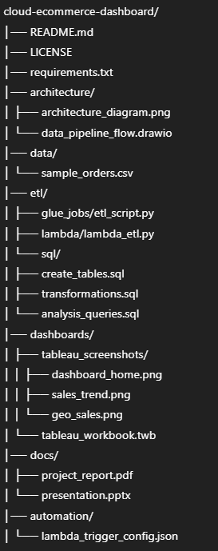

# Cloud E-commerce Dashboard (AWS + Tableau)

## Overview
This project builds a cloud-based data analytics pipeline for E-commerce sales.  
Data is stored in **AWS S3**, processed using **AWS Glue / Lambda**, queried using **AWS Athena / Redshift**, and visualized in **Tableau**.  
It provides insights into revenue trends, top products, and customer segmentation.

---

## Architecture

**Workflow & Datapipeline flow**

1. Raw E-commerce data is uploaded to **AWS S3**.  
2. **ETL process** using AWS Glue or Lambda cleans and transforms the data.  
3. Processed data is stored back in **S3** in Parquet format.  
4. **Athena / Redshift** queries the data for analysis.  
5. **Tableau** connects to the query layer to create interactive dashboards.

---

## Tech Stack
- **Cloud:** AWS S3, Glue, Lambda, Athena, Redshift  
- **ETL & Scripting:** Python (Pandas, Boto3, AWS Wrangler)  
- **Visualization:** Tableau  
- **Querying:** SQL  

---

## Dataset
- Source: [Brazilian E-commerce Olist Dataset on Kaggle](https://www.kaggle.com/datasets/olistbr/brazilian-ecommerce)  
- Contains:
  - Orders (order_id, product_id, customer_id, date, price, quantity)  
  - Products (category, price, rating)  
  - Customers (location, demographics)  
  - Payments (method, transaction amount)  

---

## Steps to Run
1. Upload raw dataset CSVs to **S3 bucket**.  
2. Run **ETL job** using Glue or Lambda to process and clean data.  
3. Query processed data using **Athena** (SQL queries provided in `etl/sql`).  
4. Connect **Tableau** to Athena or Redshift.  
5. Open dashboards and explore insights.

---

## Dashboard Features
- **KPIs:** Total Revenue, Total Orders, Total Customers  
- **Sales Trend:** Monthly revenue analysis (line chart)  
- **Top Products & Categories:** Best-selling items (bar chart)  
- **Sales by Region:** Geo map visualization  
- **Customer Segmentation:** New vs returning customers  
- **Payment Method Analysis:** Distribution of payment methods  

---

## Future Improvements
- Real-time data processing using **AWS Kinesis**  
- Predictive analytics for sales forecasting using **AWS SageMaker**  
- Integration with **QuickSight** for cloud-native dashboards  

---

## Folder Structure

---

## Author
**Atharva Kanchan** – Final Year B.Tech  
Email: atharvakanchan959@gmail.com  
LinkedIn: (https://in.linkedin.com/in/atharva-kanchan-797643271)  

---

